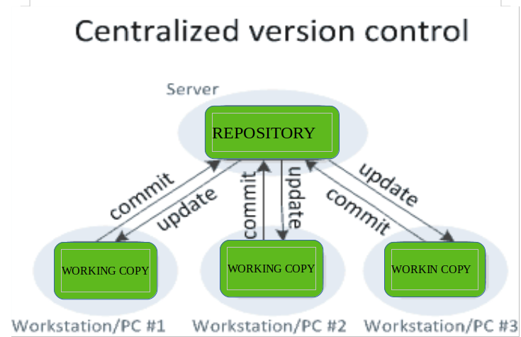
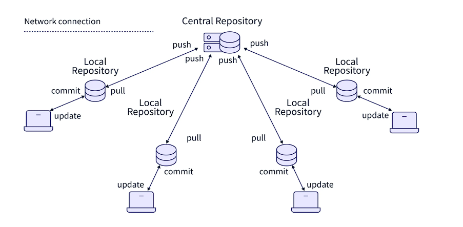

# Explanation of How Git Works

First, we have two types of version control systems:

- **Centralized Version Control:**

  

  The idea is quite simple: you will have a project on the server, and all the developers on the team will work online on the project. This means the code is modified directly, and it must be connected to the server.

- **Distributed Version Control:**

  

  The idea is very simple: you will have a project on the server, and all developers on the team will take a copy of this project and download it to their devices. It means every developer is a copy-taker of the project. Any modifications that happen to the developer's version will not affect the main project until they are added to the main one.

- **What is the difference between Git and GitHub:**
  - Git:
    Git's main role is organizing your work. It clusters your ideas, arranges files for you, and organizes everything.
  - GitHub:
    GitHub is the server or platform where we collect our projects.

- **Now let's explain how git works**

Imagine that it divided into three sections

1. **Working Directory:**
   - The working directory, also known as the working tree or working copy, is the directory on your local machine where you are currently working. It contains all the files and directories that you are actively working on or have checked out from the repository. These files can be modified, added, or deleted as part of your development process.

2. **Staging Area:**
   - The staging area, also known as the index, is like a temporary storage area where you can prepare and organize your changes before committing them to the repository. It acts as a middle ground between the working directory and the repository. You can add files to the staging area to include them in the next commit, or you can remove files from the staging area if you decide not to include them in the commit.

3. **Repository:**
   - The repository in Git is like a database or storage area where all the project files and their history are stored. It contains all the files and directories that make up your project, along with the complete history of every file.

In summary, the repository is where all the project files and history are stored, the working directory is where you do your work and make changes to files, and the staging area is where you prepare and organize your changes before committing them to the repository. These concepts are fundamental to understanding how Git manages the version control of your project.
